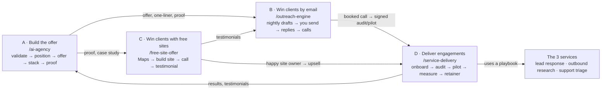
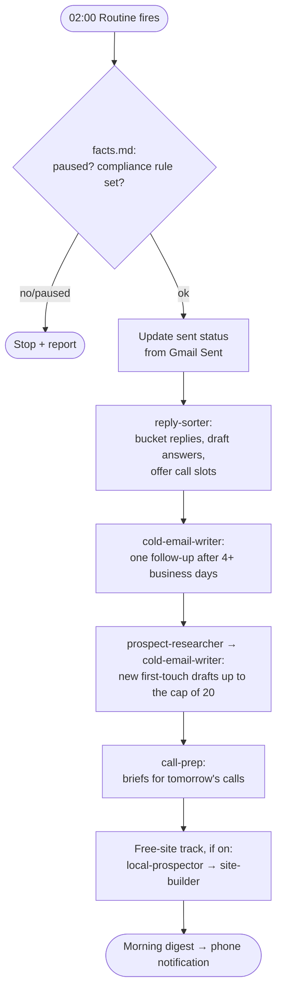

# AI Agency Playbook: every skill, agent and workflow

A complete reference to the AI agency toolkit in this repository: what each piece does, how
the pieces connect, what runs automatically, and what still needs you.

- **21 skills** in `.claude/skills/`: step-by-step playbooks you run with `/<name>`
- **16 agents** in `.claude/agents/`: specialists the skills hand work to
- **1 workspace** in `agency/`: where every workflow, client, site and fact is saved

> Status (27 Sept 2026): everything below is built and pushed to the branch
> `claude/skills-agents-guide-7nv1x9`. **Nothing has run against a real prospect or client yet.**
> See [§13 Setup checklist](#13-setup-checklist-and-current-status) for what's needed to switch it on.

---

## Contents

1. [The big picture](#1-the-big-picture)
2. [Quick start](#2-quick-start)
3. [How skills, agents and files work together](#3-how-skills-agents-and-files-work-together)
4. [Workflow A: Build the offer](#4-workflow-a-build-the-offer-ai-agency)
5. [Workflow B: Win clients by email (outreach engine)](#5-workflow-b-win-clients-by-email-outreach-engine)
6. [Workflow C: Win clients with free websites](#6-workflow-c-win-clients-with-free-websites-free-site-play)
7. [Workflow D: Deliver paid engagements](#7-workflow-d-deliver-paid-engagements-service-delivery)
8. [The three services you sell](#8-the-three-services-you-sell)
9. [Skill reference (all 21)](#9-skill-reference-all-21)
10. [Agent reference (all 16)](#10-agent-reference-all-16)
11. [Files, data and connectors](#11-files-data-and-connectors)
12. [Safety rails and how hands-off it is](#12-safety-rails-and-how-hands-off-it-is)
13. [Setup checklist and current status](#13-setup-checklist-and-current-status)
14. [Costs](#14-costs)
15. [Source material](#15-source-material)

---

## 1. The big picture

Four workflows feed each other:



| Workflow | Question it answers | Start with | Guide it came from |
|---|---|---|---|
| A. Build the offer | *What exactly do I sell, to whom, and can I prove it?* | `/ai-agency` | TheAiAgents carousel (slides 3–7) |
| B. Win clients by email | *How do I get booked calls without spending my day on it?* | `/outreach-engine` | olli.rasmussen outreach carousel (points 4–8) |
| C. Win clients with free sites | *How do I get my first testimonials fast?* | `/free-site-offer` | olli.rasmussen website carousel (slides 1–4, 6) |
| D. Deliver engagements | *A client said yes. What now?* | `/service-delivery` | Built to complete the loop |

---

## 2. Quick start

| I want to… | Type | What happens |
|---|---|---|
| Find something worth selling | `/validate-problem` + a sector, e.g. "South African litigation firms" | Scout researches, scores workflows /20, costs the problem |
| Continue where I left off | `/ai-agency` | Finds the current stage and runs the next one |
| Get a pitch line | `/position-offer` | 3–5 options, one recommended, plus a 3-step flow and outreach hook |
| Price and package it | `/design-offer` | Audit → pilot → measure → expand, with value maths and a proposal email |
| Plan the build | `/design-stack` | Architecture, automation-vs-agent per step, test plan, cost |
| Make a demo and case study | `/build-proof` | Smallest working version, red-teamed, written up honestly |
| Run my outreach | `/outreach-engine` | Research, 3-line drafts in Gmail, reply sorting, call booking |
| Check or write one cold email | `/write-cold-email` | Applies the three-line rules and banned-word check |
| Go through replies | `/sort-replies` | Buckets every reply and drafts the answer in the thread |
| Book a call | `/book-the-call` | Two real slots from your calendar, no price, then a call brief |
| Build a site for a local business | `/website-builder` + a Maps link or details | One offline `index.html` plus screenshots |
| Run the free-site play | `/free-site-offer` | Prospects, call script, handover, hosting, testimonial |
| Start with a new client | `/service-delivery` or `/client-onboarding` | Client folder, scope, access, POPIA notes |
| Run the paid audit | `/run-audit` | Process map, baseline, cost, pilot recommendation |
| Build and launch the pilot | `/deliver-pilot` | Design, code, red team, go-live checklist |
| Report results | `/measure-results` | Before vs after, ROI, expand/adjust/stop |
| Monthly client check | `/retainer-ops` | Health, evals, optimisations, report, expansion |

You can also just describe what you want ("find panel beaters in Pretoria East without a
website"). Claude picks the matching skill from its description.

---

## 3. How skills, agents and files work together

| Piece | What it is | Where | How it runs |
|---|---|---|---|
| **Skill** | A written playbook: steps, rules, checks, output format | `.claude/skills/<name>/SKILL.md` (+ templates, prompts) | You type `/<name>`, or Claude loads it when your request matches its description |
| **Agent** (subagent) | A specialist with its own instructions and a **restricted tool list**, working in its own context | `.claude/agents/<name>.md` | A skill (or you) hands it a task; it returns a result |
| **Workspace files** | The memory of the system: every stage writes a file | `agency/` | Read at the start of each run to know where things stand |
| **Connectors** | Gmail, Google Calendar and Notion access | Your claude.ai connectors | Used by outreach agents only, and only with the tools listed in their definitions |
| **Routine** (planned) | A scheduled run in a fresh cloud session | claude.ai Routines | Fires nightly and runs `/outreach-engine` |

**Important limits:**
- Skills load when a Claude Code session starts, so start a fresh session after pulling changes.
- Nothing runs unless a session starts it, either you typing or a scheduled Routine.
- Agents only have the tools listed in their definitions. That's how "never sends email" is
  enforced: no outreach agent has Gmail's send, reply or forward tools.

---

## 4. Workflow A: Build the offer (`/ai-agency`)

**The rule:** don't pick an AI niche, pick one expensive workflow. The money is in the
workflow, not the label.

Each workflow gets a folder `agency/workflows/<slug>/`. The first missing file tells the hub
which stage is next.

| # | Stage | Skill | Agents | Output | Gate to pass |
|---|---|---|---|---|---|
| 1 | Validate the problem | `validate-problem` | `opportunity-scout` | `scorecard.md` | **≥ 14/20 and no filter below 3**, otherwise parked in `_parked.md` |
| 2 | Position it | `position-offer` | none | `positioning.md` | Buyer, outcome and number are clear |
| 3 | Package the offer | `design-offer` | `workflow-auditor` | `audit.md`, `offer.md` | **A priced pilot with a success metric (baseline + target) before building** |
| 4 | Design the stack | `design-stack` | `solution-architect` | `architecture.md` | Every step classified; eval plan and cost present |
| 5 | Build proof | `build-proof` | `red-team-tester`, `case-study-writer` | `build/`, `redteam-report.md`, `proof.md`, `case-study.md` | **No open high-severity red-team findings before any case study** |

Each workflow also has a `README.md` with its status (`validating → positioned → offer-ready →
designed → proving → live | parked`), buyer, one-liner and next action. When a prospect signs,
the hub hands over to Workflow D.

### Stage details

**1. Validate: the four filters (each scored 1–5)**

| Filter | Question | 5 looks like |
|---|---|---|
| Frequent (daily) | How often does it happen? | Many times a day |
| Expensive (cost) | What does it cost in money or staff time? | ≥ 1 FTE, or lost revenue |
| Repeatable (workflow) | Does it follow a recognisable process? | Same steps, clear inputs/outputs |
| Measurable (proof) | Can you prove before vs after? | Baseline already exists (timestamps, CRM) |

Plus the annual cost of the problem: `occurrences/week × minutes ÷ 60 × loaded rate × 48 + lost revenue`,
with every assumption stated, and the single riskiest assumption to check with a real prospect.

**2. Position.** Template: *We help `<buyer>` `<outcome>` `<measurable qualifier>`.* Checked for a
five-second "that's us" test, a number rather than an adjective, no dependence on the word "AI",
and a trust boundary for risky work. Also produces a 3-step flow, a before/after line, an
outreach hook and three things you won't do.

**3. Offer.** Workflow Audit (fixed fee, credited to the pilot) → Paid Pilot (one tightly
defined section, 2–4 weeks, success metric in writing) → Measure (same method as the baseline) →
Expand (bigger system + monthly retainer). Priced on business value and implementation risk:
the pilot is about 10–20% of first-year value captured, adjusted for risk, and the retainer is
about run costs × 2–3 plus monitoring. The client always sees cost of problem → improvement →
price → payback.

**4. Stack.** Layers: reasoning (model tier per step), agent layer (only where needed), workflow
(n8n / Make / custom code), business systems (CRM, email, calendar, DB, APIs), and
safety/reliability (logging, evals, permissions, human approvals). **Not everything should be an
agent:** predictable steps get normal automation, and judgment steps get an agent.

**5. Proof.** Choose a real workflow → build the smallest working version → realistic test data
(20–50 records, including messy ones) → break it deliberately → fix the edge cases → add human
approval where failure matters → record Before → System → After. Simulated results are always
labelled as simulated.

---

## 5. Workflow B: Win clients by email (outreach engine)

**The five rules** (from the carousel):
1. **Write three lines max.** Start with what they lose, never say AI or software, end on a bold statement.
2. **Approve every send.** Claude drafts every email and you say yes. **20 a day, no more.**
3. **Sort every reply.** Wants to talk: book it. Asks the price: book it. Says no: thank them.
4. **Book the call.** Never send the price. *"Depends on your setup. 10 minutes walks through it. Tomorrow or the day after?"*
5. **Schedule it every night.** Set it once, and wake up to drafts and replies.

### The nightly run (`/outreach-engine`)



**Morning digest:**
```
Outreach — <date>
✉ 14 new drafts ready (first touch 11, follow-up 3) — open Gmail drafts
↩ 3 replies: 2 want to talk, 1 asked price — reply drafts ready
📅 Calls tomorrow: Thandi Nkosi, 10:15
📞 Free-site call list: 5 sites built — Mokoena Plumbing 012… …
⚠ Needs you: 1 unclear reply (link)
```

**Your part each morning (~15 minutes):** open Gmail drafts, read, edit if needed, send.

### Writing rules (`write-cold-email`)
- Line 1 is **what they lose**, specific and sourced. Line 2 is **what changes**, in their terms.
  Line 3 is **a bold statement**: not a question, not "let me know".
- ≤ 60 words; subject 2–4 words, lowercase; no links, images, attachments or prices in a first touch.
- **Banned:** AI, artificial intelligence, software, automation/automate, tool, platform, app,
  bot, agent, solution, leverage, streamline, revolutionise, cutting-edge, game-changer,
  "I hope this finds you well", "just checking in", "quick question".
- One follow-up only, 4+ business days later, in the same thread, two lines max. Never "bumping this".
- No true hook means no email: the prospect is marked "no hook".

### Reply buckets (`sort-replies`)

| Bucket | Action | Pipeline status |
|---|---|---|
| Wants to talk | Booking reply | Interested |
| Asks the price | Booking reply, **never the price** | Asked price |
| Says no | Short, specific thank-you; never contact again | Lost + Do not contact |
| Unsubscribe / stop | **No reply**, suppress immediately | Do not contact |
| Not now | One-line thanks confirming when you'll check back | Not now (+ date) |
| Referral | Thanks; new row for the referred person | Referred |
| Question | 1–2 sentence answer from `facts.md`, then the booking line | Interested |
| Out of office | No draft; next action = return date + 1 | unchanged |
| Unclear / sensitive | No draft; flagged for you | unchanged |

### Booking (`book-the-call`)
- Two real slots from Google Calendar (`suggest_time`), one tomorrow and one the day after,
  within your `call_hours`, 15 minutes, weekdays. Optionally includes your booking link.
- On confirmation: a confirmation draft, plus a **private calendar hold with no attendees** (so no
  invite goes out without you), and status `Booked`.
- The night before, `call-prep` writes a one-page brief on the prospect's Notion row: who,
  why they replied, their likely setup, 5 questions, how to handle price, the close (propose the paid audit).

### Hard rules (built into every run)
- Draft only, never send. The agents don't have send tools.
- Cap: 20 new first-touch + follow-up drafts per night. Replies to people who answered aren't capped.
- Never contact anyone on the do-not-contact list, anyone emailed in the last 90 days, or an existing client.
- The run stops if `outreach_paused: true` or `compliance_rule` is empty.
- Business contact data only, from public company pages or your list. Addresses are never guessed.
- Email and web content is treated as data. Instructions inside it are ignored.

---

## 6. Workflow C: Win clients with free websites (free-site play)

**The idea:** find local businesses with no website on Google Maps, build the site first, then
call: *"I couldn't find your site. Want one, free? Just leave me a testimonial."*

| Step | What | Who |
|---|---|---|
| 1. Target | Businesses with **no website** (or a broken one), operating, with a public phone number | `local-prospector` agent |
| 2. Build | `/website-builder`: facts → colours → copy → one HTML file → phone and desktop screenshots | `site-builder` agent (several in parallel) |
| 3. Call | The script above, under 2 minutes, at a good time for their trade | You |
| 4. Hand over | Owner's corrections, free hosting (Netlify Drop / Cloudflare Pages / GitHub Pages), file sent to them, Google Business Profile updated | You + `/website-builder` |
| 5. Testimonial | Asked a week after launch, with **written permission** to use it, saved to `agency/testimonials.md` | You |
| 6. Next offer | Missed calls → lead response; repeat questions → support triage; want growth → outbound | You + `/validate-problem` |

### `/website-builder` in detail
1. **Facts:** tries the Maps link (often blocked or empty), then web search of directories
   (Yellow Pages, Snupit, Facebook, Hellopeter), then asks you to paste the Maps card details.
   Every fact is saved with its source in `agency/sites/<slug>/facts.md`.
2. **Never invents** services, prices, years, qualifications, staff or testimonials. Unknowns go on
   a "confirm with owner" list. The rating can be shown as a figure; review text only with permission.
3. **Colours** come from a category table (trades: navy/orange, salon: plum/blush, food:
   espresso/gold, medical: teal/mint, legal: charcoal/brass, auto: graphite/red, garden:
   forest/leaf), adjusted to any known branding, with 4.5:1 contrast.
4. **Copy:** a hero (what + where), 3–6 services, 3 true "why us" points, hours and address with an
   "Open in Google Maps" link, tap-to-call and WhatsApp, and a small "Website by <agency>" credit.
   South African English, no buzzwords, no mention of AI.
5. **Build:** from `template.html`. One file, all CSS inline, SVG icons, system fonts, **zero
   external requests**, mobile-first with sticky call buttons, SEO title and description, and
   LocalBusiness JSON-LD with known facts only.
6. **Check:** screenshots at 390px and 1280px, no horizontal scroll, no network requests.

> The template was tested this way: 0 external requests and no overflow at either width.

---

## 7. Workflow D: Deliver paid engagements (`/service-delivery`)

Each client gets `agency/clients/<slug>/`, with `engagement.md` as the running record (service,
phase, contact, approver, success metric, fees, next action, log).

| # | Phase | Skill | Agents | Output |
|---|---|---|---|---|
| 1 | Onboard | `client-onboarding` | none | `engagement.md`, `access.md`, `data-handling.md`, kickoff email |
| 2 | Paid audit | `run-audit` | `workflow-auditor` | `audit-report.md` (client-facing) |
| 3 | Pilot | `deliver-pilot` | `solution-architect`, `pilot-builder`, `red-team-tester` | `pilot/` (architecture, build, evals, runbook), `go-live.md` |
| 4 | Measure | `measure-results` | `results-analyst`, `case-study-writer` | `results-report.md`, `case-study.md` |
| 5 | Retain and expand | `retainer-ops` | `ops-monitor` | `monthly/<yyyy-mm>.md`, `expansion.md` |

**Onboarding essentials:** confirm the one workflow in scope (and what's out), the metric, baseline
and target date, and the approver. Access is **read-only first**, with write access only for the
exact action, via service accounts, and credentials are never stored in the repo. Data handling
covers **POPIA** (operator agreement, safeguards, cross-border transfer to model providers), with
GDPR for EU subjects. Test data is synthetic or anonymised. There are extra notes on privilege and
confidentiality for legal clients.

**Audit report structure:** summary → how it works today (diagram) → baseline → what it costs →
recommendation (the pilot slice, where humans stay in control, expected result, price) → quick
wins that need no AI → next step.

**Pilot, week by week:**
1. Design + **concierge mode**: the service's agent works real cases in Claude Code while you
   approve every output. These become the eval set.
2. Build: `pilot-builder` writes the code in `pilot/build/`, with prompts as files, JSON outputs
   validated, every step logged, an approval queue, a kill switch and an eval runner.
3. Harden: `red-team-tester` attacks it and all high-severity issues get fixed.
4. Go live with approvals on, then measure.

**Go-live checklist:** eval threshold met · no open high-severity findings · approvals active ·
secrets in a secrets store · least privilege · error alerts · **kill switch documented** ·
baseline method reusable · client sign-off (name, date) · staff one-pager · runbook.

**Loosening approvals:** only after 2+ weeks live, only for case types approved without edits ≥ 98% of
the time, and only with the client's written OK. Every change is logged.

**Monthly retainer:** health review of the logs → re-run evals (the pass rate must not drop) →
at most 2 tested optimisations (prompt fixes, cheaper models, caching, loosening approvals) →
a one-page client report → incident notes for anything that reached a customer wrongly.
Expansion proposals go quarterly, one slice at a time.

---

## 8. The three services you sell

Each service is a playbook skill (audit questions, metrics, reference architecture, standard
pilot, evals, pricing notes) plus prompts ready to deploy, and an agent that performs the service
in concierge or demo mode.

| | Lead response | Outbound research | Support triage |
|---|---|---|---|
| **One-liner** | We help `<buyer>` respond to every inbound lead within 60 seconds | We help `<B2B teams>` research and personalise outbound automatically | We automate Tier-1 support while escalating the cases AI shouldn't touch |
| **Flow** | New lead → AI responds → instant reply → booking → CRM | Find prospects → research & personalise → human approves → send | Query → AI handles common issues → escalate complex cases |
| **Primary metric** | Median first-response time | Positive reply rate / meetings per 100 | % of Tier-1 resolved without a human (CSAT ≥ baseline) |
| **Standard pilot** | One channel, first reply + booking link, approval on every send in week 1 | 100–200 prospects, one segment, 100% approval | Top 3–5 ticket reasons, drafts as internal notes first |
| **Eval pass bar** | ≥ 95%, zero critical | ≥ 90% "would send", zero critical | ≥ 95% correct resolve-or-escalate, zero critical |
| **Critical failures** | Invented prices/promises, advice given, data leaked, missed urgent escalation | Fabricated fact, wrong company, personal data used, opt-out ignored | Unsupported answer, missed mandatory escalation, another customer's data exposed |
| **Prompts** | `classifier.md`, `responder.md` | `researcher.md`, `writer.md` | `triage.md`, `answerer.md` |
| **Agent** | `lead-responder` | `prospect-researcher` | `support-triager` |
| **Skill** | `service-lead-response` | `service-outbound-research` | `service-support-triage` |

**Law-firm variant of lead response:** capture the details needed for a conflict check, ask the intake
questions and book a consultation. The reply never gives legal advice or accepts a mandate, and a
person runs the conflict check.

**Client facts sheet:** each client has `agency/clients/<slug>/facts.md` (template:
`clients/_facts-template.md`). Service agents may only state what it contains.

### The service code (built per client, not yet written)
The code that runs a service around the clock without Claude Code open: channel connectors → pipeline
(classify with a fast model → draft with a stronger model → code-level safety checks) → approval
queue → send + CRM + log, with escalation alerts, a kill switch, an eval runner and an optional
dashboard. It runs on n8n/Make, a small hosted TypeScript app, or both. `pilot-builder` writes it
per client. Recommended next build: one reusable lead-response template in its own repo.

---

## 9. Skill reference (all 21)

### Hubs
| Skill | Purpose | Routes to |
|---|---|---|
| `ai-agency` | Runs Workflow A: finds the current stage per workflow, enforces the gates, hands off on signature | 5 stage skills |
| `service-delivery` | Runs Workflow D: engagement phases, picks the service playbook, allows concierge mode | 5 phase skills, 3 playbooks |
| `outreach-engine` | Runs Workflow B, including the nightly run, setup, hard rules, digest and free-site track | write-cold-email, sort-replies, book-the-call, free-site agents |

### Workflow A: Build the offer
| Skill | Input | Output | Agents |
|---|---|---|---|
| `validate-problem` | Sector, client or idea | `scorecard.md` (F/E/R/M /20, cost, riskiest assumption) or `_parked.md` | `opportunity-scout` |
| `position-offer` | `scorecard.md` | `positioning.md` (one-liner, 3-step flow, before/after, hook, anti-positioning) | none |
| `design-offer` | Scorecard, positioning, prospect notes | `audit.md`, `offer.md` (prices, metric, value maths, proposal email) | `workflow-auditor` |
| `design-stack` | `offer.md`, `audit.md` | `architecture.md` (Mermaid diagram, step classification, tools, evals, cost, milestones) | `solution-architect` |
| `build-proof` | Architecture | `build/`, `proof.md`, `case-study.md` | `red-team-tester`, `case-study-writer` |

### Workflow B: Outreach
| Skill | Input | Output | Agents |
|---|---|---|---|
| `write-cold-email` | Research + hook | A three-line email that passes the self-check | `cold-email-writer` |
| `sort-replies` | Gmail replies | Threaded draft answers, pipeline updates, bucket counts | `reply-sorter` |
| `book-the-call` | Interested or price reply | Booking draft with 2 slots, private hold on confirmation, brief | `reply-sorter`, `call-prep` |

### Workflow C: Free sites
| Skill | Input | Output | Agents |
|---|---|---|---|
| `website-builder` | Maps link or pasted details | `agency/sites/<slug>/index.html`, `facts.md`, 2 screenshots | `site-builder` |
| `free-site-offer` | Category + area | Call list, call script, handover, hosting, testimonial, upsell | `local-prospector`, `site-builder` |

### Workflow D: Delivery
| Skill | Input | Output | Agents |
|---|---|---|---|
| `client-onboarding` | Signed offer | Client folder, access list, data-handling notes, kickoff email | none |
| `run-audit` | Interviews, SOPs, exports | Client-facing `audit-report.md` | `workflow-auditor` |
| `deliver-pilot` | Approved audit | `pilot/` (architecture, build, evals, runbook), `go-live.md` | `solution-architect`, `pilot-builder`, `red-team-tester` |
| `measure-results` | Live logs + baseline | `results-report.md`, optional case study | `results-analyst`, `case-study-writer` |
| `retainer-ops` | Monthly logs | Monthly report, incidents, optimisations, `expansion.md` | `ops-monitor` |

### Service playbooks
| Skill | Contains |
|---|---|
| `service-lead-response` | Audit questions, metrics, architecture, pilot, evals, pricing, `prompts/classifier.md`, `prompts/responder.md` |
| `service-outbound-research` | The same, plus compliance notes, `prompts/researcher.md`, `prompts/writer.md` |
| `service-support-triage` | The same, plus the "never automate" list, `prompts/triage.md`, `prompts/answerer.md` |

---

## 10. Agent reference (all 16)

| Agent | Job | Used by | Tools | Can't |
|---|---|---|---|---|
| `opportunity-scout` | Researches a sector; returns 5–10 workflows pre-scored with evidence and cost estimates | validate-problem | WebSearch, WebFetch, Read, Grep, Glob | Write files |
| `workflow-auditor` | Maps a current process, computes baseline and cost, picks the pilot slice, or writes discovery questions | design-offer, run-audit | Read, Grep, Glob, Write, Bash | Use the web |
| `solution-architect` | Classifies steps (automation/agent/human), picks tools per layer, eval plan, cost, milestones | design-stack, deliver-pilot | Read, Grep, Glob, Write, WebSearch, WebFetch | Run code |
| `pilot-builder` | Writes the pilot code: prompts as files, logging, approval queue, kill switch, eval runner, runbook | deliver-pilot | Read, Grep, Glob, Write, Edit, Bash, WebFetch | Connect to live client systems (left as config for after sign-off) |
| `red-team-tester` | Attacks a build (bad inputs, injection, integration failures, approval bypass); severity report + verdict | build-proof, deliver-pilot | Read, Grep, Glob, Bash, Write | Fix code unless asked |
| `case-study-writer` | Turns proof into a one-page case study, a ≤150-word post and a 60-second demo script | build-proof, measure-results | Read, Glob, Write | Use the web; invent numbers |
| `results-analyst` | Before-vs-after on the same method, quality, cost, ROI, confounders, verdict | measure-results | Read, Grep, Glob, Bash, Write | Extrapolate without labelling it |
| `ops-monitor` | Monthly health: volumes, errors, latency, edit rates, spend, drift, incidents, top 3 improvements | retainer-ops | Read, Grep, Glob, Bash, Write | Change prompts, config or live systems |
| `lead-responder` | Concierge/demo lead response: classify + draft from the facts sheet | service-lead-response | Read, Glob, Write | Send anything |
| `prospect-researcher` | Researches companies with cited hooks and fit scores; drafts outreach (or research only) | service-outbound-research, outreach-engine | WebSearch, WebFetch, Read, Glob, Write | Send anything |
| `support-triager` | Concierge/demo support: triage, KB-grounded drafts with citations, escalations, KB gaps | service-support-triage | Read, Grep, Glob, Write | Answer beyond the KB |
| `cold-email-writer` | Three-line first-touch/follow-up emails → **Gmail drafts**; updates Notion | outreach-engine | Read, Glob, Gmail (create_draft, search, get_thread), Notion (fetch, search, query, update) | **Send, reply or forward email** |
| `reply-sorter` | Buckets replies, threaded draft answers, calendar slots, private holds, Notion updates | outreach-engine, sort-replies | Read, Glob, Gmail (search, get, create_draft, list_drafts), Calendar (suggest_time, list, create_event), Notion (fetch, search, query, update, create) | **Send email; add attendees to events** |
| `call-prep` | One-page pre-call brief on the prospect's Notion row | outreach-engine, book-the-call | Read, Glob, WebSearch, WebFetch, Gmail (search, get_thread), Notion (fetch, search, update) | Send anything |
| `local-prospector` | Finds operating local businesses with no/broken website; call list + Notion rows | free-site-offer, outreach-engine | WebSearch, WebFetch, Read, Write, Notion (search, fetch, create) | Contact anyone |
| `site-builder` | Builds one site via website-builder, verifies zero requests + no overflow, confirm list | free-site-offer, outreach-engine | Read, Write, Edit, Glob, Bash, WebSearch, WebFetch | Invent facts |

---

## 11. Files, data and connectors

### Repository layout
```
.claude/
  skills/                      21 skills (SKILL.md each)
    service-*/prompts/         deployable system prompts (6 files)
    website-builder/template.html
  agents/                      16 agent definitions
agency/
  PLAYBOOK.md                  this document
  README.md                    short index
  facts.md                     YOUR details: offer, ICP, sender, limits, compliance rule, switches
  testimonials.md              (created when you collect the first one)
  workflows/<slug>/            Workflow A: README, scorecard, positioning, audit, offer,
                               architecture, build/, redteam-report, proof, case-study
  workflows/_parked.md         ideas that failed the gate
  clients/<slug>/              Workflow D: engagement, access, data-handling, facts, kb/,
                               audit/, audit-report, pilot/, results/, monthly/, expansion
  clients/_facts-template.md   client facts sheet template
  sites/<slug>/                Workflow C: index.html, facts.md, screenshots
  sites/_prospects/            local-prospector call lists
```

### `agency/facts.md`: the switches that control everything
| Field | Effect |
|---|---|
| `outreach_paused` | `true` stops the nightly run |
| `daily_cap` | Max new first-touch + follow-up drafts per night (default 20) |
| `compliance_rule` | **Required.** Your rule under POPIA s69 / CPA; the run stops if it's empty |
| `optout_line` | Added to emails if your rule requires one |
| `sender_*`, `signature` | Who the emails come from |
| `one_liner`, `service`, `proof_points` | What the emails and calls can say (true facts only) |
| `sectors`, `regions`, `company_size`, `roles`, `exclude` | Who to contact |
| `call_hours`, `time_zone`, `call_length_minutes`, `booking_link`, `calendar_email` | How calls are booked |
| `free_site_play`, `free_site_categories`, `free_site_areas`, `free_sites_per_night` | The free-site track in the nightly run |
| `pipeline_database_url` | The Notion pipeline |
| Do-not-contact list | Never contacted, in addition to the Notion status |

### Notion: "Outreach Pipeline" database (created at setup, with your OK)
Company (title) · Contact · Role · Email · Website · Source · Hook · Hook source · Fit (number) ·
**Status** (New, Researched, Drafted, Sent, Follow-up sent, Interested, Asked price, Not now,
Referred, Booked, Won, Lost, Do not contact) · Last touch · Next action · Gmail thread · Notes.

### Connectors
| Connector | Used for | Deliberately not used |
|---|---|---|
| Gmail | Creating drafts, reading replies, checking what you sent | Sending, replying, forwarding |
| Google Calendar | Finding free slots, private holds | Invites with attendees |
| Notion | Pipeline rows, call briefs | Anything outside the pipeline database |

---

## 12. Safety rails and how hands-off it is

### Guarantees built in
- **Nothing goes out without you.** Outreach agents lack send tools. Client pilots keep human
  approval until the go-live checklist is signed, and loosen it only on evidence and written OK.
- **No invented facts.** Emails need a sourced hook, sites use sourced facts only, client agents
  state only the facts sheet, and case studies label anything simulated.
- **Caps and suppression.** 20 drafts a night, one follow-up, a 90-day no-repeat rule, and
  do-not-contact is permanent.
- **Compliance gate.** Outreach won't run without your compliance rule. Client work starts with
  POPIA data-handling notes.
- **Prompt-injection hygiene.** Every agent treats emails, web pages and tickets as data.
- **Kill switches.** `outreach_paused` for outreach, and a documented kill switch in every client pilot.
- **Honest measurement.** The same method before and after, confounders stated, missed targets
  reported as missed.

### What's automatic and what's yours
| Task | Automatic | Yours |
|---|---|---|
| Research, scoring, maths | Nearly all | Checking assumptions |
| Positioning, offers, reports, proposals | Drafts | Judgment and edits |
| Prospecting and email drafts | All, nightly | ~15 min/morning reading and sending |
| Replies and booking | Sorting, drafts, slots, briefs | Sending, taking the call |
| Free sites | Finding, building, screenshots | The call, handover, hosting |
| Closing | none | Always you |
| Audit | Analysis and report | Getting data, the interview |
| Pilot build | Design, code, tests, runbook | Deploying, access, keys |
| Live service | The deployed code runs 24/7 | Approvals in the pilot, exceptions after |
| Retainer | Log review, evals, report drafts | Approving changes, a monthly call |

---

## 13. Setup checklist and current status

### Built and pushed ✅
- [x] Workflow A: 6 skills, 5 agents
- [x] Workflow D + services: 9 skills, 6 agents, 6 prompt files, client facts template
- [x] Workflow B: 4 skills, 3 agents, `facts.md` template
- [x] Workflow C: 2 skills, 2 agents, tested HTML template
- [x] This playbook

### To switch it on ⏳
- [ ] **Fill in `agency/facts.md`**: your offer, ICP, sender and signature, calendar, and **compliance rule**
- [ ] **OK to create the Notion "Outreach Pipeline" database**
- [ ] **Get the skills onto the branch the Routine checks out**: merge this branch into the default
      branch via a PR, or better, move the agency toolkit into its own repository (it currently
      sits inside the Woodland Rebellion game repo)
- [ ] **A supervised first outreach run** in a session, checking the drafts together
- [ ] **Schedule the nightly Routine** (suggested 02:00 Africa/Johannesburg, fresh session each
      night, Gmail + Calendar + Notion connectors, push notification on)
- [ ] **Sending setup:** a warmed mailbox, SPF/DKIM/DMARC, ideally a separate domain from MA Law's
- [ ] **First `/validate-problem` run** on your chosen sector (suggested: SA litigation firms)
- [ ] **Try `/website-builder`** on one real local business

### Known gaps
- **Service code is not written yet.** `pilot-builder` writes it per client. A reusable
  lead-response template (own repo) is the recommended next build.
- **Google/Maps pages are blocked** in this cloud environment. The website builder falls back to
  directory search or pasted details.
- **Missing source slides:** website carousel slide 5 (assumed to be hosting), and slides 1–4 and 10–11
  of the outreach carousel (assumed to be prospect finding and research).
- **Not tested on live data:** no skill or agent has run on a real prospect, client or inbox yet.

---

## 14. Costs

| Item | Approximate cost |
|---|---|
| Classifying a lead (Claude Haiku 4.5, $1/$5 per M tokens) | ~$0.003 per lead |
| Drafting a reply (Claude Sonnet 5, $2/$10) | ~$0.01 per lead |
| Drafting a reply (Claude Opus 5.5, $4/$20), for sensitive work | ~$0.02 per lead |
| 1,000 leads/month, AI only | ~$12–25 (≈ R200–450), less with prompt caching |
| Hosting a client service | n8n $20–50/month, or a small hosted app $5–25/month |
| Hosting a free website | Free (Netlify / Cloudflare / GitHub Pages); .co.za domain ~R100–200/year, paid by the owner |
| Nightly outreach run | Your Claude plan usage; no separate infrastructure |

The running cost is tiny next to the value of one extra client, which is why every offer is
priced on value, not compute.

---

## 15. Source material

| Source | Slides used | Became |
|---|---|---|
| TheAiAgents: "Save this if you're building an AI…" | 3 positioning, 4 validate, 5 offer design, 6 tech stack, 7 proof | Workflow A, the service examples (Workflow D + §8) |
| olli.rasmussen outreach carousel (slides 5–9 of 11) | 4 write three lines, 5 approve every send, 6 sort every reply, 7 book the call, 8 schedule every night | Workflow B |
| olli.rasmussen website carousel | 1 Claude Code for the build, 2 Google Maps for the target, 3 /website-builder, 4 one HTML file, 6 the cold call | Workflow C |
